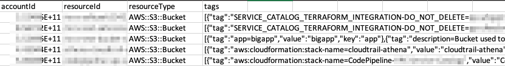
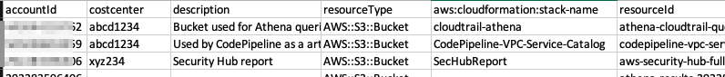

# Script to export AWS Config Advanced Query results as CSV with tags as columns

[AWS Config](https://aws.amazon.com/config/) [Advanced Queries](https://docs.aws.amazon.com/config/latest/developerguide/querying-AWS-resources.html) can be very helpful in querying the current configuration state of AWS resources, even across multiple accounts and regions. However, when exporting the search results of a query containing tags to a CSV format, the tags are exported as a JSON array of tag/value objects, which is difficult to process in spreadsheets. As of writing, there is [“No support for nested structures (such as tags) to be unpacked with SQL queries.”](https://docs.aws.amazon.com/config/latest/developerguide/querying-AWS-resources.html)

This script allows exporting the results of a multi-account AWS Config Advanced Query to a CSV file with a new column for every tag, making it easier to see the owners, cost centers, etc of resources.

For example, if you run the following query for all S3 buckets with versioning turned off:

```sql
SELECT
  accountId,
  resourceId,
  resourceType,
  tags
WHERE
  resourceType = 'AWS::S3::Bucket'
  AND supplementaryConfiguration.BucketVersioningConfiguration.status = 'Off'
ORDER BY
  tags.key
```

The standard AWS Config query CSV export would look like:



Using the script to run the same query would result in a CSV file like _(notice the "costcenter" and "description" column with the tag values. As a bonus, the account IDs are also exported as strings instead of numbers, so they don't show up as "1.23456E+11"._):




### Usage

The script only requires read-only access to AWS Config Advanced queries. While you can run the script locally, the following steps uses [AWS CloudShell](https://aws.amazon.com/cloudshell/) so that you do not need Python installed locally:

-  Download the file [config-query-export-csv-tags.py](config-query-export-csv-tags.py) somewhere on your device. If you are not using Control Tower, edit the file and change the line `default_aggregator = "aws-controltower-GuardrailsComplianceAggregator"` to the name of your AWS config aggregator. 

- Log into your central (aggregator) AWS Config account. In an AWS Control Tower environment, this is the Audit account.

- Start up AWS CloudShell

- _(one-time step, unless you don’t access CloudShell for 6 months)_ In the top right of the terminal, click on Actions -> Upload file, and select [config-query-export-csv-tags.py](config-query-export-csv-tags.py)

- Run the command:

```
python config-query-export-csv-tags.py
```

- Then paste your AWS Config SQL query, with the SELECT statement also selecting the tags column. If you get a warning about “Safe paste”, just select Paste. For example:

```sql
SELECT
  accountId,
  resourceId,
  resourceType,
  tags
WHERE
  resourceType = 'AWS::S3::Bucket'
```

- Press enter and Control+D

- Follow the instructions on the screen (i.e. Actions -> Download, and enter results.csv)

- The tags should be visible in separate columns in the downloaded results.csv file.

If the csv file has too many columns, and you just want specific tags, you can use the `--tags` argument in the script to specify the tags you want as a comma separated case sensitive list with no spaces, for example:

```bash
python config-query-export-csv-tags.py --tags Name,description
```

## Security

See [CONTRIBUTING](CONTRIBUTING.md#security-issue-notifications) for more information.

## License

This library is licensed under the MIT-0 License. See the LICENSE file.

